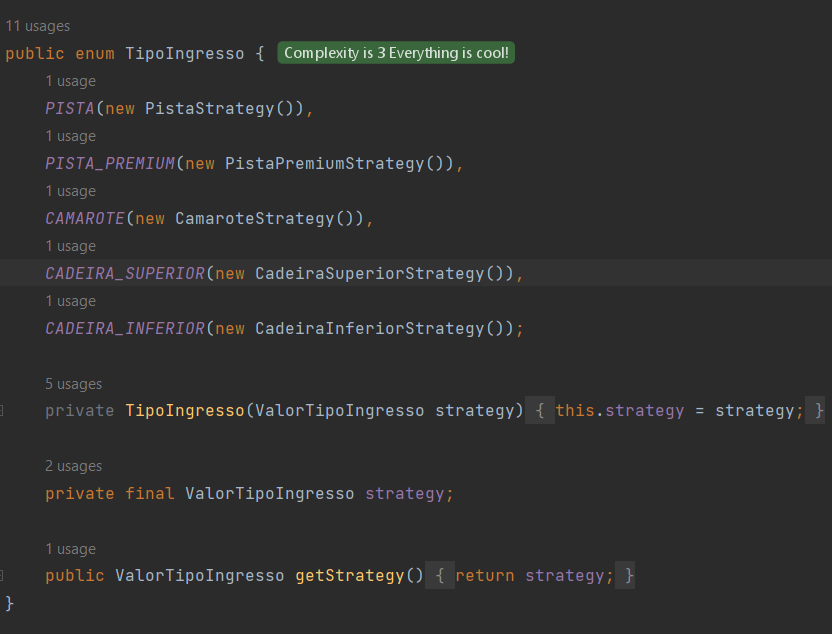
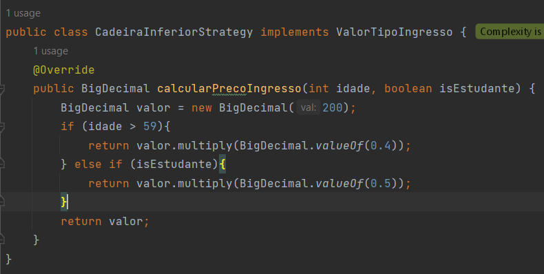

O que é Design Patterns? 
    Design patterns nada mais seriam do que padrões de design de código.

Por que é interessante utilizá-los?
    Porque como o nome sugere, são padrões, então uma vez seguindo um padrão durante o desenvolvimento de um projeto
    você e seus colegas conseguiriam se localizar melhor. Dado que segundo o padrão você saberia se uma classe existe,
    onde uma classe está e se tem ou não o método esperado.

Quais são as categorias de Design Patterns?

### Criacionais
Os padrões criacionais, como o nome já diz, envolvem a criação de objetos. Eles
controlam a maneira com a qual os objetos serão instanciados no projeto.

### Estruturais
Estes envolvem a estrutura do projeto. Controlam a maneira de montar objetos 
em estruturas maiores para se manter flexibilidade e eficiência.

### Comportamentais
Os mesmos dizem respeito à responsabilidade em objetos, permitindo que o 
programador encapsule código e separe ele de forma que tais coisas aconteçam mediante
as instâncias.

### Arquiteturais (menção honrosa)
Estes apesar de não serem tão citados também existem, porém, são padrões mais macro
envolvem a arquitetura do projeto e como será o fluxo da aplicação. Estes são geralmente aplicados de forma diferente
dependendo do escopo da aplicação.

#### Para cada tipo de Design Pattern acima, cite 1 Design Pattern.

Criacional: 
    O Builder usa  

Estrutural:
    O Facade

- Comportamental:

O Strategy conta com a utilização de enums para as regras de negócio, delegando-lhes decidir o que acontecer conforme seu valor.
Acredito que um bom exemplo é o do projeto atual, veja que você tem um enum que chama uma estratégia e cada uma dessas 
estratégias implementam uma interface, calculando o valor do ingresso conforme o tipo

  
 ##
  

Sem esse padrão de projeto, por exemplo, a alternativa seria implementar um if else gigante para calcular. 
Para maiores detalhes de como implementar esse padrão, segue um link:
https://refactoring.guru/pt-br/design-patterns/strategy

- Arquitetural:

O MVC é muito comum na criação de APIs

Para cada Design Pattern citado, explique com suas palavras o motivo de sua utilização em um projeto de Software.

#### Como testar o trabalho

Para testar os métodos nas classes, vá na main e altere as seguintes informações
- a data de nascimento do usuário na linha 14;
- se o usuário é estudante na linha 16;
- a ocupação do evento na linha 30;
- a categoria de ingresso que ele irá comprar na linha 34;

Deixei 2 métodos comentados nas linhas 39 e 39, eles servem para garantir que 
ao comprar o ingresso ele será adicionado ao evento e o evento adicionado à lista de eventos do usuário.

tomei como base o site https://refactoring.guru/pt-br/design-patterns