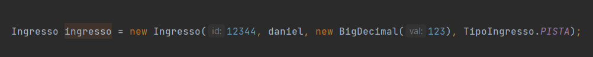
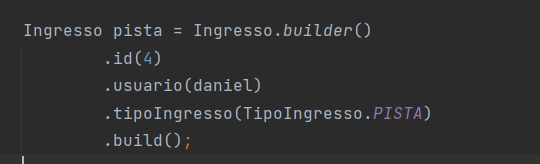
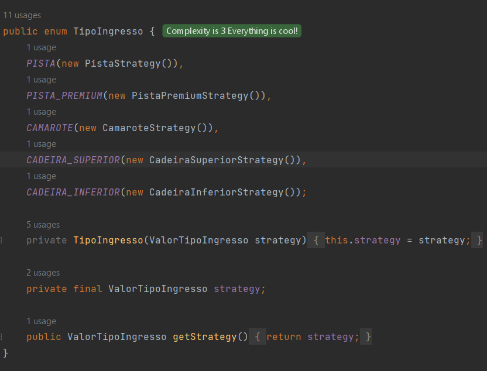
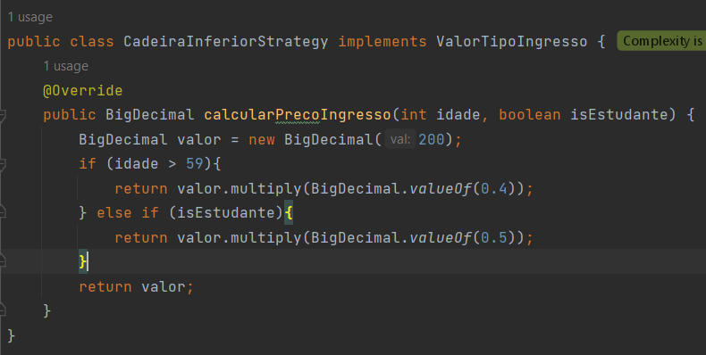
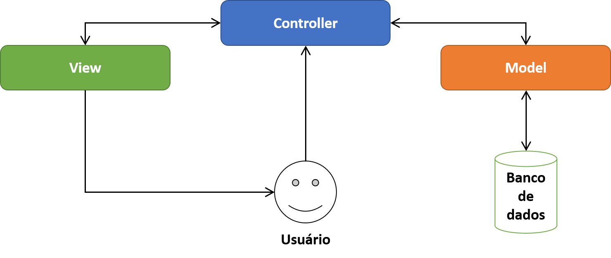

## O que é Design Patterns? 
    Design patterns nada mais seriam do que padrões de design de código.

## Por que é interessante utilizá-los?
    Porque como o nome sugere, são padrões, então uma vez seguindo um padrão durante o desenvolvimento de um projeto
    você e seus colegas conseguiriam se localizar melhor. Dado que segundo o padrão você saberia se uma classe existe,
    onde uma classe está e se tem ou não o método esperado.

## Quais são as categorias de Design Patterns?

### Criacionais
Os padrões criacionais, como o nome já diz, envolvem a criação de objetos. Eles
controlam a maneira com a qual os objetos serão instanciados no projeto.

### Estruturais
Estes envolvem a estrutura do projeto. Controlam a maneira de montar objetos 
em estruturas maiores para se manter flexibilidade e eficiência.

### Comportamentais
Os mesmos dizem respeito à responsabilidade em objetos, permitindo que o 
programador encapsule código e separe ele de forma que tais coisas aconteçam mediante
as instâncias.

### Arquiteturais (menção honrosa)
Estes apesar de não serem tão citados também existem, porém, são padrões mais macro
envolvem a arquitetura do projeto e como será o fluxo da aplicação. Estes são geralmente aplicados de forma diferente
dependendo do escopo da aplicação.

#### Para cada tipo de Design Pattern acima, cite 1 Design Pattern.

- Criacional: 

O Builder usa de subclasses e métodos para facilitar a instância de objeto, observe na imagem abaixo que com um 
construtor padrão fica difícil de saber qual informação você está passando antes de ele estar completo

   

O builder serve para acabar com isso, veja exemplos abaixo de como ele fica quando é chamado:

   

Como pode observar na imagem acima, fica mais claro a informação que você está inserindo no objeto, fora que diferentemente
do construtor, você não é obrigado a inserir todas as informações ou a criar mais de um dependendo do que quer informar.
Segue um link com melhores explicações do padrão de projeto e de como implementá-lo
https://refactoring.guru/pt-br/design-patterns/builder

- Estrutural:

O Facade é um padrão que tem como base a ideia de prover uma única interface para uma biblioteca ou framework
cheio de métodos e objetos. Como exemplo, eu utilizaria a Amazon, que provém diversos serviços e produtos,
estes seriam seus métodos e objetos, a interface que simplifica tudo seria, por exemplo, o atendente na loja física 
ou o canal de informações no site/aplicativo dela. Perceba que você não precisa ficar indo atrás de informações de terceiros
para saber como usufruir dos serviços dela, justamente por ela já ter uma interface para isso.

Esse padrão de projeto, eu infelizmente não tenho nenhum exemplo de código, porém se quiser estudar melhor
segue o link com um artigo explicando ele: https://refactoring.guru/pt-br/design-patterns/facade

- Comportamental:

O Strategy conta com a utilização de enums para as regras de negócio, delegando-lhes decidir o que acontecer conforme 
seu valor. Acredito que um bom exemplo é o do projeto atual, veja que você tem um enum que chama uma estratégia 
e cada uma dessas estratégias implementam uma interface, calculando o valor do ingresso conforme o tipo.

  
 ##
  

Sem esse padrão de projeto, por exemplo, a alternativa seria implementar um if else gigante para calcular. 
Para maiores detalhes de como implementar esse padrão, segue um link:
https://refactoring.guru/pt-br/design-patterns/strategy

- Arquitetural:

O MVC é muito comum na criação de APIs, eu mesmo já utilizei algumas vezes e ele serve basicamente para determinar o fluxo
que a API irá tomar. Geralmente o Fluxo segue a imagem abaixo: 

 

Existem 3 camadas, onde a primeira o modelo (banco de dados e objetos), segunda controller (regras de serviço
e URLs de acesso) e View (o frontend, seja ele um site ou aplicativo).

O fluxo é o seguinte, o usuário faz uma requisição apartir da camada View, essa que,
contata a camada de controller, que a partir das regras de negócio e métodos chama o 
banco de dados para devolver ao usuário o que ele quer.

Segue um link com maiores detalhes https://www.freecodecamp.org/news/the-model-view-controller-pattern-mvc-architecture-and-frameworks-explained/

### Para cada Design Pattern citado, explique com suas palavras o motivo de sua utilização em um projeto de Software.

O Builder, apesar de só agora estar fazendo ele no braço, já utilizei ele algumas vezes na construção de APIs, principalmente
na hora de converter DTOs e modelos justamente por ser mais simples e melhor para fazer instancias e conversões.

O Facade eu para ser honesto nunca utilizei, porém, pretendo em breve criar um projeto simples só para testá-lo.

O strategy eu estou utilizando pela primeira vez, porém por ser mais clean e prático, provavelmente irei implementar
no projeto que estou trabalhando atualmente.

O MVC é um padrão que venho seguido sempre na construção de APIs, principalmente por acreditar ser bem organizado,
fora o fato de ser o único que conheço.

#### Como testar o trabalho

Para testar os métodos nas classes, vá na main e altere as seguintes informações
- a data de nascimento do usuário na linha 14;
- se o usuário é estudante na linha 16;
- a ocupação do evento na linha 30;
- a categoria de ingresso que ele irá comprar na linha 34;

Deixei 2 métodos nas linhas 36 e 37, eles servem para garantir que ao comprar o ingresso
ele será adicionado ao evento e o evento adicionado à lista de eventos do usuário.

Tomei como base o site https://refactoring.guru/pt-br/design-patterns