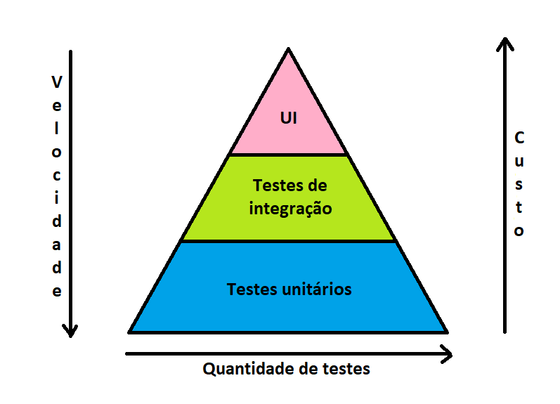

# Pirâmide de Testes Automatizados

## Explique, com suas palavras, a importância da adoção dos Testes Automatizados dessa categoria;

Apiramide de testes, nada mais seria que um esquema que define o custo e
o tempo que os testes levam.

Na imagem acima, você pode ver 3 partes da piramide, os testes unitários,
de integração e Ponta a ponta. A piramide define dentre eles, qual leva 
mais tempo e qual custa mais, além de definir também a quantidade de 
testes a serem feitos.

### - Testes unitários:

São os de menor custo e tempo, porém devem ser feitos em maior quantidade,
estes testam a unidade minia do teste, cada método de cada classe,
para garantir que tudo funciona. A automação é importante nos testes unitários
(principalmente em ambiente remoto) para garantir que apesar das 
mudanças nos métodos, estes continuam exercendo sua função corretamente.

### — Testes de integração

São os de quantidade, custo e tempo médio. Estes testam a comunicação 
entre os serviços, servem para garantir que as APIs, serviços e pedaços
do projeto se interagem de forma correta. Em ambiente remoto a automação
deles se faz necessária para certificar que mesmo mudanças nos métodos
e pedaços da aplicação, tudo continua funcionando e que essas partes 
do projeto continuam interagindo entre si corretamente.

### - Testes Ponta a ponta

Estes são os de maior custo e tempo, e por conta disso são feitos em pouca
quantidade, eles testam se a aplicação na totalidade funciona, se quando o 
usuário fizer uma requisição vai ter o retorno certo, se o backend terá o 
comportamento esperado dependendo da requisição, entre outras. A automação 
deles por que como foi dito, eles testam a aplicação toda e garantem que
em ambiente de produção os diferentes cenários acontecerão conforme suas 
condições são atendidas.

## Cite exemplos de aplicação desses Testes;

### Teste unitário:

Imagine que você tem uma classe chamada "caixaAutomático", e dentro dela tem os
métodos de saque, deposito, extrato e transferência. Com os testes unitários 
você pode testar se uma conta está recebendo um acréscimo ou decréscimo no salto
se foi de fato feito o extrato, se é possível realizar uma transferência com 
determinados valores... Com o teste unitário, é possível testar todas as regras
de negócio.

### Teste de integração:

Agora para os testes de integração, imagine que você tem no backend do projeto,
diversas APIs e micro serviços, com consultas, banco de dados, protocolos 
diferentes e afins, com os testes de integração, você consegue garantir que eles 
interagem de forma certa, que o fluxo está de forma correta, se um dos serviços 
está recebendo e devolvendo as informações de forma esperada, etc...

### Teste ponta a ponta:

Agora para testes ponta a ponta imagine que você tem um ‘e-commerce’, e em diferentes
situações o usuário será redirecionado para uma página, ou receberá um sms,
ou simplesmente não poderá realizar a compra, o teste ponta-a-ponta garante que em 
diferentes cenários, ocorrerá o esperado, se houve o redirecionamento, se o 
usuário recebeu a notificação, se a realização de compra foi negada ou proibida...

### Testes automatizados: 

Estes, envolvem todos acima citados, é basicamente eles sendo executados de 
forma automática, sem que o QA ou o desenvolvedor terem que executar um a um.

Estes têm suas vantagens e desvantagens, pois apesar de poupar tempo, sempre
executam tudo da mesma forma, não mudando a jornada ou a maneira que as coisas são
feitas.

Segue um exemplo de teste automatizado usando selenium:
> https://github.com/DRodrigues17/selenium-test

## Quais Tecnologias/Frameworks poderiam ser utilizados em cada Categoria?

### Testes Unitários:
- JUnit4
- Jest
- Jasmine
- Mockito

### Testes de Integração:
- MockMVC
- JUnit5

### Testes ponta-a-ponta:
- Selenium
- Cypress

### Testes Automatizados:
- Selenium
- Robotium
- Cucumber
